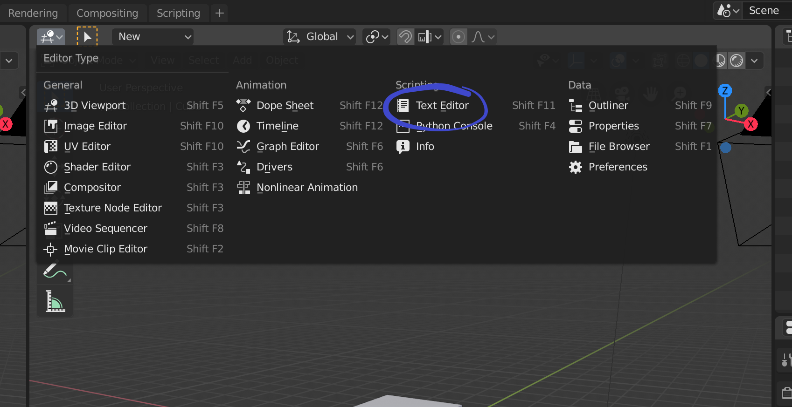

# Mad(dy)Man(deep)Huy

MadManHuy is a Blender 2.8 add-on, written in Python using scikit-image and scikit for Digital Image Processing final project.

## Installation and Usage

Blender 2.80 embeds its own Python3 interpreter in the Blender application. On Windows,
the python3.exe executable allows us to install pip alongside the embedded Python.

Navigate to your python directory in your Blender directory. For 2.80 this is likely to be
`\blender\2.80\python`. Once in the directory run the following command `bin\python.exe lib\ensurepip`.
This will install pip into the `Scripts` directory inside your Blender version directory. Next,
use this pip to install `numpy`, `opencv-python`, and `pydicom`.

With [Blender 2.80](https://www.blender.org/2-8/) installed and opened, [drag open another window](https://docs.blender.org/manual/es/dev/interface/window_system/areas.html?highlight=split%20window), then change the window to a text editor window (`Shift+F11`).

Click open, then navigate to `marching_cubes_script.py` and open it. Change the path of the images in the script to the directory storing the images, then click `Run Script`.

## Resources

Useful Resources for Blender 2.80 dev
https://wiki.blender.org/wiki/Reference/Release_Notes/2.80/Python_API/Addons#Naming
https://wiki.blender.org/wiki/Reference/Release_Notes/2.80/Python_API/Scene_and_Object_API
